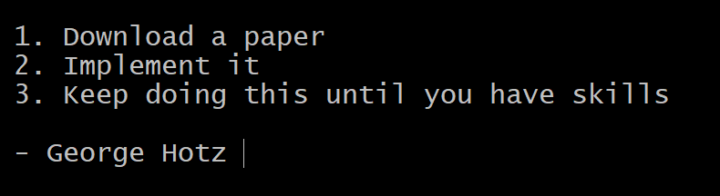

# Deep Learning Papers
Attempt to implement famous deep learning papers in PyTorch. 
Following advice by [George Hotz](https://github.com/geohot) for my own learning.

For more details, [visit website](https://github.com/Siddharth1India/Deep-Learning-Papers)